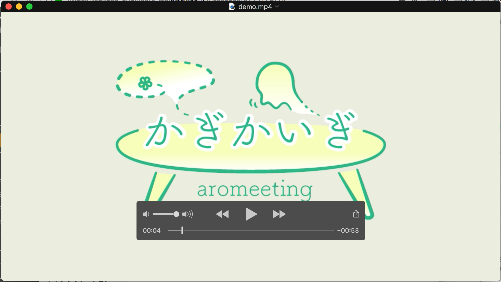
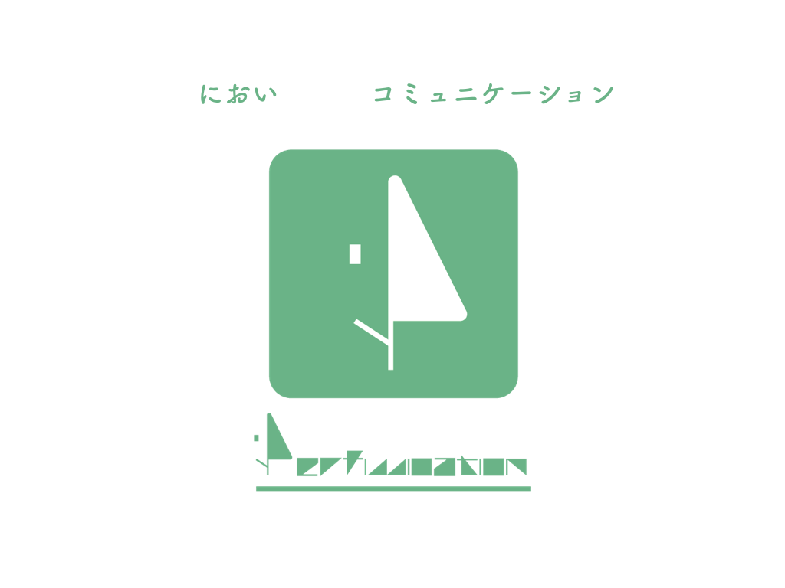
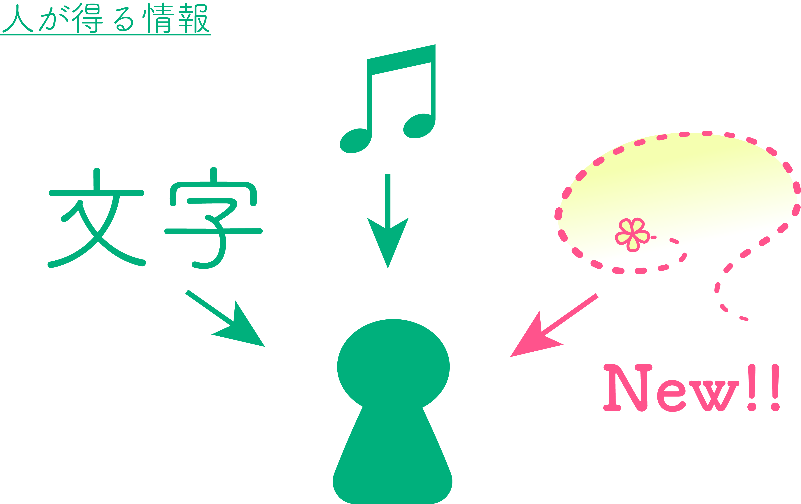
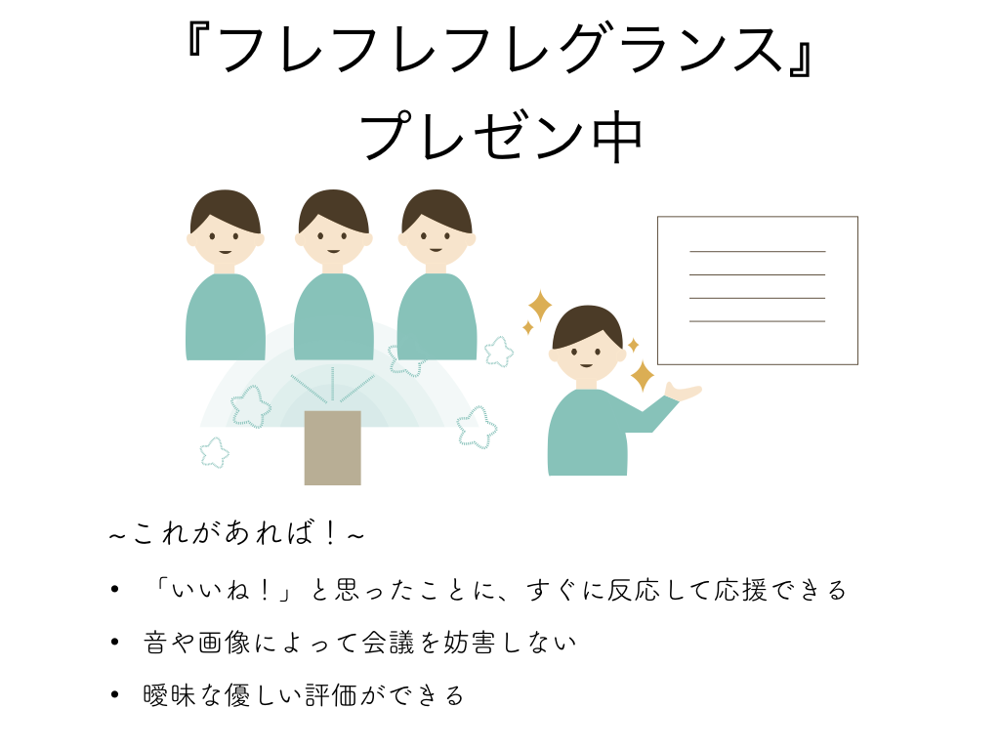
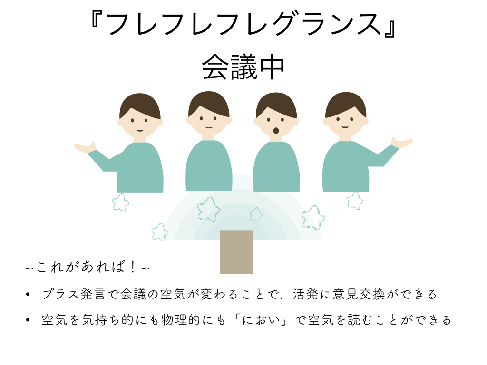
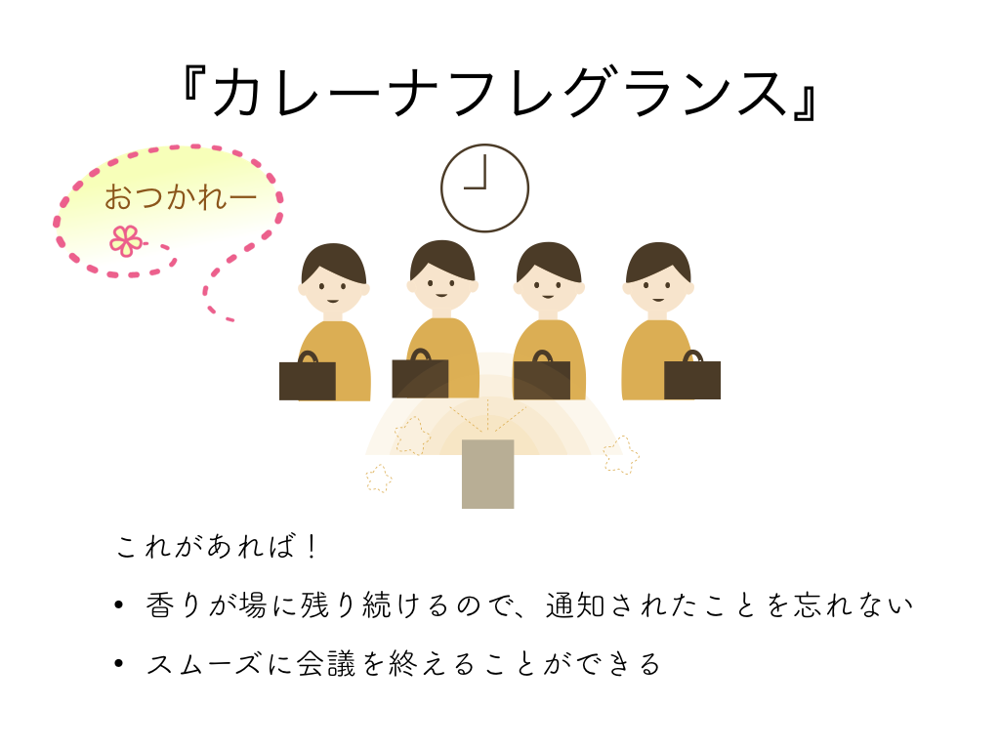
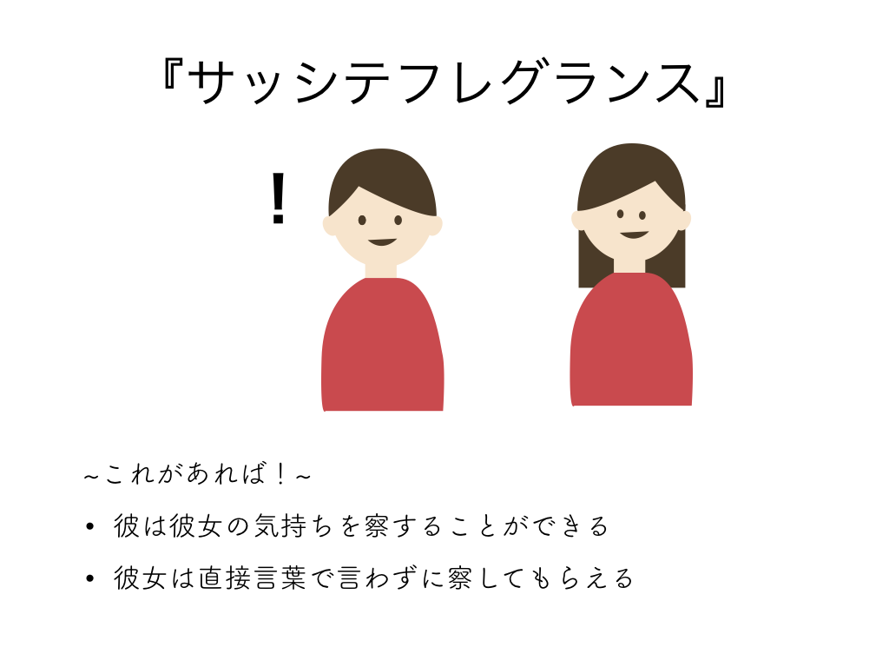
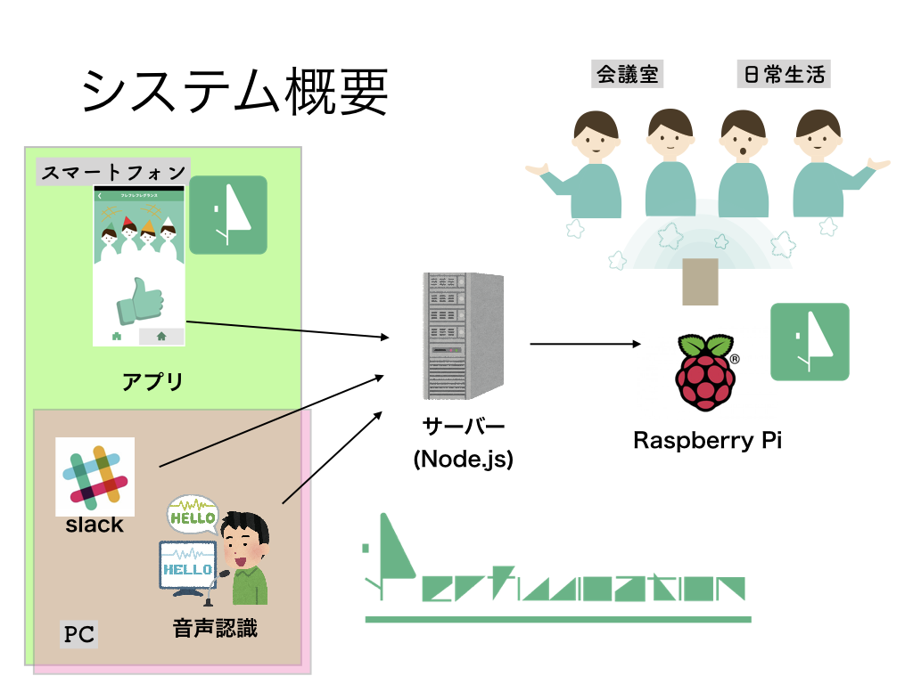
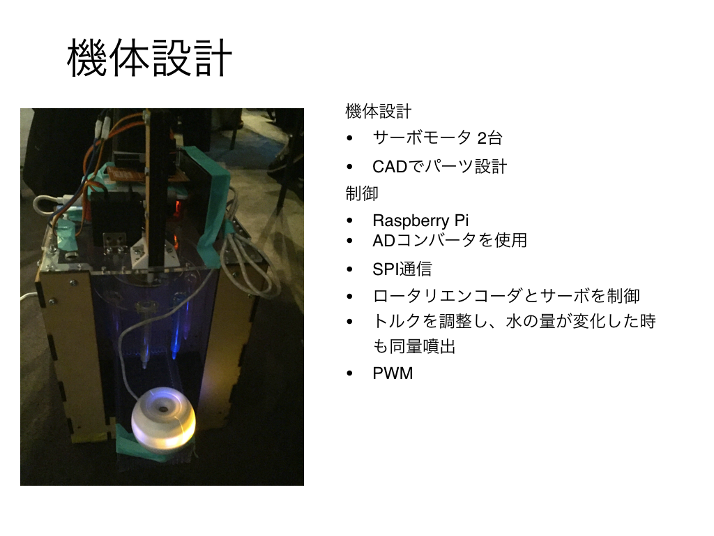

# ~~かぎかいぎ~~ Perfumecation

**「かぎかいぎ」は用途を会議のみに絞らず、においによるコミュニケーションにより広く対応できるように「Perfumecation」としてパワーアップいたしました！**

**デモ動画(旧版)**

## 製品概要
### におい x Tech

### 背景（製品開発のきっかけ、課題等）

「ニオイ」にしか変えられないもの。
「ニオイ」だから伝わるコトがあるはず。

「Perfumecation」では、『かぐ情報』というコミュニケーションの新しいかたちを提案します。

#### 着目した顧客・顧客の課題・現状

日常的に人間は周囲からさまざまな方法で情報を得ています。しかし、PCやスマホなどのデバイスでは文字、画像、音によるコミュニケーションが主となっています。しかし、それらのコミュニケーション法は明確に、分かりやすい情報をしか伝えることができません。そこで我々は「におい」が持つ情報のあいまいさに着目し、それらをさまざまな利用シーンでの活用法を提案します。

### 製品説明

本製品『Perfumecation』では、

- 専用スマホアプリ
- 音声認識
- slackのチャットボット

からの入力をもとに、その場に応じたにおいを判断し、出すことができます。

Perfumecationには大きく3つの機能があります。

#### 1. フレフレフレグランス

フレフレフレグランスは活発な会議を支援する機能です。

プレゼンテーション中などに、話者をスマホアプリから応援することで、それを表すにおいが放出されます。私語が禁止でもにおいで伝えることができます。発表者は聴衆の反応を匂いで知ることができるので自身をもってプレゼンテーションを続けることができるようになります。

また、通常の会議中では活発な議論を推進するために、音声認識によりポジティブな発言を抽出し、ポジティブ発言がたまると良いにおいが漂います。

フレフレフレグランスでは"におい"を以下のように活用しています。

- あいまいな表現ができる
- 空気を変えられる
- 一緒に場を共有する価値が生まれる

#### 2. カレーナフレグランス

カレーナフレグランスは華麗なにおいが会議終了時間をお知らせする機能です。

会議が時間どおりに終わらずだらだら長引いてしまう。気づいていても「終わりましょう」とは言いづらい。そんな悩みを解決します。

あらかじめスマホアプリから会議時間を設定しておきます。設定した会議終了時間が近づくと、華麗なにおいが放出されます。空気自体を変えることで、スムーズに会議終了へと持っていくことができます。

カレーナフレグランスでは"におい"を以下のように活用しています。

- その場に一定時間漂う
- においを身にまとう

#### 3. サッシテフレグランス

彼女の気持ちをにおいで察することができます。

なにかがすれ違っているけど、直接言うのが恥ずかしい。そんなカップル、夫婦にサッシテフレグランスは最適です。

何かを察してほしいときにはスマホアプリからにおいを放出しておきます。相手が帰ってきた時にそのにおいを感じることで、なにかあったんだなと言うことを察することができます。

#### Slack対応

上で紹介したすべての機能はスマホアプリの他にSlackのチャットボットとしても実装されています。ミーティング中などでも自然に使用することができます。

### 特長

#### 1. slackからの投稿・音声認識から言語抽出して、場の雰囲気の分析を行い、必要な香りを提供する

#### 2. Rasbarry Pi による制御により、複数の香りを提供

#### 3. 自作デバイスによる取り替え可能な香り

### 解決出来ること

においによって会議の **空気** を作り出し、
- 会議を円滑に進め
- 時間の把握ができ
- 秘密も伝えられる

上記のようなメリットが実現できます。

### 今後の展望

現在は会議に特化したにおいの演出を行うが、その他の場面でも活用できるように拡張したいです。

#### 例えば

- 機体の小型化
- においに関する他の機能の追加

## 開発内容・開発技術

### 活用した技術
#### API・データ

* 音声認識API
* Slack Real Time Messaging API

#### フレームワーク・ライブラリ・モジュール

* Unity
* Express
* slackbots
* WebSocket
* Wiring Pi

#### デバイス

* Rasberry Pi

### 研究内容・事前開発プロダクト（任意）

* 3Dプリンタによるデバイス本体の作成

### 独自開発技術（Hack Dayで開発したもの）
#### 2日間に開発した独自の機能・技術

* 香水を発射するデバイスの製作 (画像参照)
* においを管理するサーバーの実装
* 会議の空気を読む音声認識の実装
