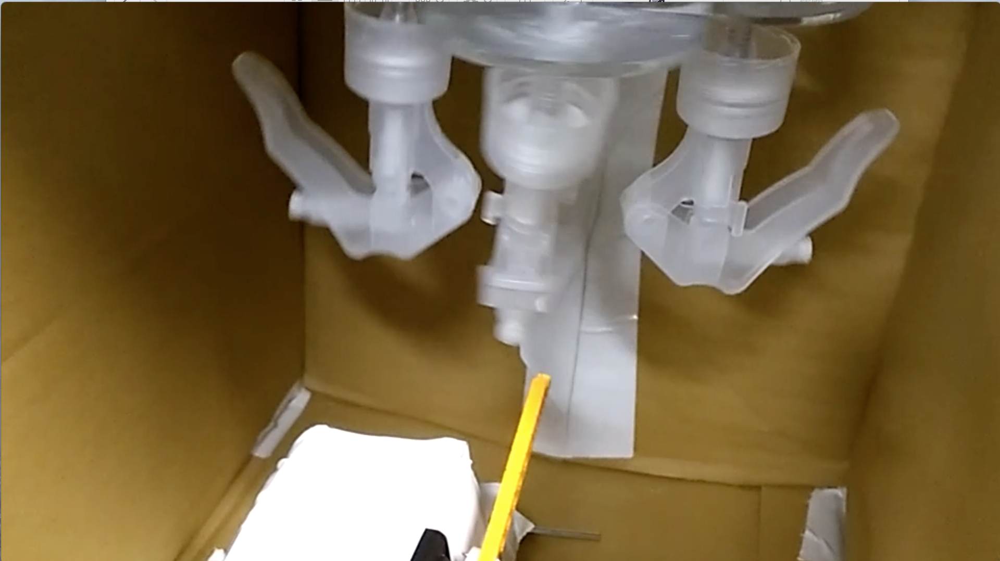

# かぎかいぎ

## 製品概要
### におい x Tech

### 背景（製品開発のきっかけ、課題等）

「ニオイ」にしか変えられないもの。
「ニオイ」だから伝わるコトがあるはず。

「かぎかいぎ」では、『かぐ情報』という情報伝達の新しいかたちを提案します。

- 着目した顧客・顧客の課題・現状

日常的に行われる会議、ミーティングなどでは、場に流れる空気によってその質が変わります。せっかく能力のある人が集まった会議でも、一度重い空気が流れてしまうとなかなか活発な議論を取り戻すことができません。そこで「かぎかいぎ」では会議の空気を読み、その場に適した **におい** を出すことで、空気の改善を図ります。

また、一般にコンピュータから得られる感覚である視覚や聴覚での情報の伝え方は限定的であるため、それを拡張することも目的としました。

### 製品説明

本製品『かぎかいぎ』では、

- ブラウザから取得した会話からの音声認識
- slackへの投稿

から言葉を抽出し、会議の予定や、読み取った会議の場の雰囲気に応じた **におい** を提供するデバイスを提案しました。においを「嗅ぐ」と「会議」を組み合わせたプロダクトです。

このデバイスでは、においを使った

1. 感情伝達
2. 想起・通知

を実現します。

このデバイスには3つのモードが有ります。

#### 1. かぐ空気(ムード)

ブラウザから音声認識して、言葉を抽出し、
その内容から会議の雰囲気を読み取って、空気(ムード)に応じたにおいを提供します。

例えば、
- 「おっけー」「いいね！」などのポジティブな言葉が多く発せられた時
    - より気持ちがエキサイトするように柑橘系のかおり
-  「ダメ」「最悪」などのポジティブな言葉が多く発せられた時
    - 気分が落ち着くようにアロマのかおり

#### 2. かぐ時間(タイムテーブル)

じわっとかわる特性を活かしたニオイによる **思い出し** を実現します。
Slack Botへの書き込みによって、会議のタイムテーブルと時間に対応した **におい** を設定できます。

これにより、においによって伝える事が可能です。

#### 3. かぐ暗号(サイン)

その場にいるみんなには知られたく無いけどある人には伝えたい、「かぎかいぎ」ではそんな **秘密の情報** (サイン) を伝えることもできます。

Slack Botに話しかけることで指定のにおいを出すことができるので、
あらかじめ「このにおいのときはこういう意味だよ」ということを共有しておくことで、他の人には気づかれずに情報を伝える事ができます。

### 特長

#### 1. slackからの投稿・音声認識から言語抽出して、場の雰囲気の分析を行い、必要な香りを提供する

#### 2. Rasbarry Pi による制御により、複数の香りを提供

#### 3. 自作デバイスによる取り替え可能な香り

### 解決出来ること

においによって会議の **空気** を作り出し、
- 会議を円滑に進め
- 時間の把握ができ
- 秘密も伝えられる

上記のようなメリットが実現できます。

### 今後の展望

## 開発内容・開発技術
### 活用した技術
#### API・データ

* 音声認識API
* Slack Real Time Messaging API

#### フレームワーク・ライブラリ・モジュール

* Express
* slackbots
* WebSocket
* Wiring Pi

#### デバイス

* Rasberry Pi

### 研究内容・事前開発プロダクト（任意）

* 3Dプリンタによるデバイス本体の作成

### 独自開発技術（Hack Dayで開発したもの）
#### 2日間に開発した独自の機能・技術

* 香水を発射するデバイスの製作
* においを管理するサーバーの実装
* 会議の空気を読む音声認識の実装
